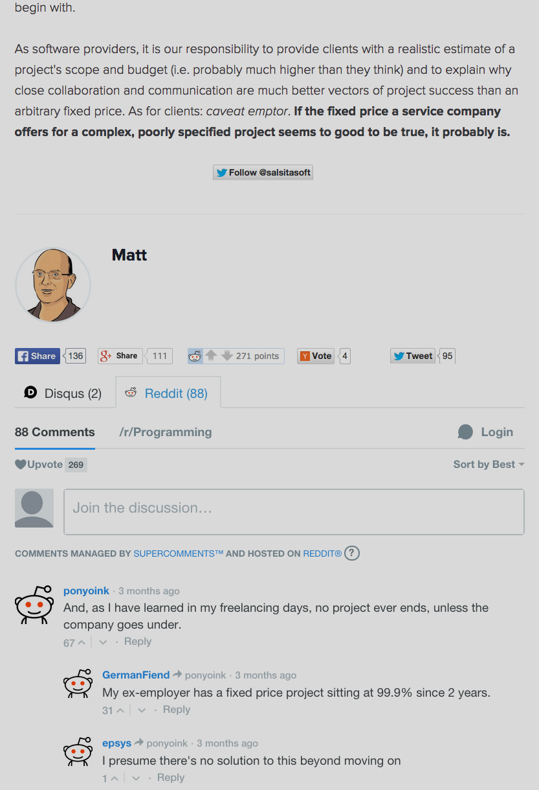

# Supercomments
*Reddit comment threads without leaving your blog or website!*


---

Don't you hate it when your blog post gets dozens of comments on Reddit but none on your own site? Supercomments lets you embed Reddit comment threads directly on your blog or website so the visitors don't have to go elsewhere to participate in the conversation. With Supercomments, you can do pretty much anything you can do on Reddit: post new comments, reply to existing comments, upvote, downvote and sort by date or relevance.

Supercomments is designed as an extension to the excellent [Disqus](http://www.disqus.com) commenting system. As such, visitors will be able to access both Disqus and Reddit comment threads in separate tabs using the same user interface. This means you even get features of Disqus that Reddit doesn't offer, like collapsing part of the discussion thread.

## Installing

### Create a Disqus site
[Sign up for Disqus](https://disqus.com/admin/signup/) if you don't already have an account, then [create a new site](https://disqus.com/admin/create/). You can skip this step if you already have Disqus on your site and just want to extend it to support Reddit threads using Supercomments.

### Get your Reddit API key
Log into Reddit and go to the [app preferences page](https://www.reddit.com/prefs/apps/). Create a new app, selecting the "installed app" type. Fill in whatever you want for name. For the redirect URI, you can use the URL of any site you control, since you will just be dropping in a short script to handle the OAuth redirect (see next section). For example, you could use the root URL of your website. Save the app and note down the consumer key (displayed under the app's name and "installed app" in the list of apps on your prefs page).

### Set up the OAuth redirect script
Put the following code in the `<head>` of your website root or some other page that you control:

```
    <script type="text/javascript">
        var code = window.location.href.match(/.*#access_token=(.[^&]+)/);
        var csrf = window.location.href.match(/.*&state=(.[^&]+)/);
        if (code && csrf) {
          window.opener.postMessage({ token: code[1], state: csrf[1] }, '*');
          window.close();
        }
    </script>
```

Make sure you set the redirect URI of your Reddit app accordingly (see previous section). This code lets you use your page as the redirect URI for OAuth by detecting when the Reddit authorization page redirects to your site (which is done in a popup window), then posting the relevant information (access token and CSRF state) to the Supercomments frame and closing the popup.

### Upload the Supercomments script
Put the `dist/js/supercomments-embed.min.js` file somewhere on your web server. This is the only file you need to run Supercomments.

### Add the Supercomments script
Add the following code to your blog or site template in the place you want Supercomments to appear (replacing the Disqus code if you have it installed already):

```
    <script>
      var supercommentsConfig = {
        url: window.location.href,
        reddit: {
          consumerKey: [your_reddit_consumer_key],
          redirectUri: [your_website_url]
        },
        disqus: {
          identifier: [your_disqus_id_(optional)],
          forum: [your_disqus_shortname]
        }
      };
    </script>
    <div id="supercomments"></div>
    <script src="../js/supercomments-embed.min.js"></script>
```

Obviously you should replace the path to `supercomments-embed.min.js` with the path pointing to the file on your server.

If you don't know how to get your [Disqus identifier](https://help.disqus.com/customer/portal/articles/472098-javascript-configuration-variables#disqus_identifier), you should be okay omitting it since Disqus will use the URL of the post to identify it in this case.

## Building

If you want to build your own version of Supercomments, just pull the repository, run `npm install` and then run `gulp webpack-embed`. This will create the `supercomments-embed.js` file in `dist/js`.

Once you've built the normal version, you can create minify it by running `gulp compress-app` and then `gulp compress-embed`. This creates `supercomments.embed.min.js`.

To run the tests, use `npm test`.